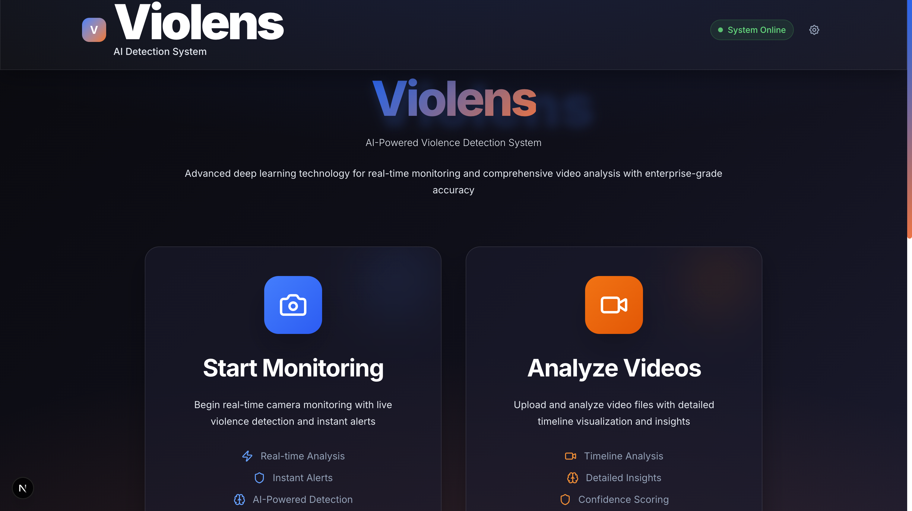

# Violens Frontend — AI Violence Detection System

A polished Next.js + TypeScript frontend for uploading videos, running AI analysis via a backend API, and visualizing detections with an interactive timeline and contextual analysis. Includes a live monitoring mode using the browser camera.



## Features

- Video upload with preview, local conversion fallback when browser format isn’t supported
- One-click AI analysis via backend `/analysis` endpoint
- Interactive timeline with risk-highlighted segments (high/medium/low)
- Contextual analysis cards:
  - Overall analysis: risk level, detection count, duration
  - Detailed view: selected detection type, time range, confidence
- Live monitoring mode with camera stream and risk indicator
- Modern glassmorphism UI, responsive layout, and accessibility affordances

## Tech Stack

- Next.js (App Router) + React + TypeScript
- Tailwind CSS + custom design system (`globals.css`)
- `lucide-react` icons

## Prerequisites

- Node.js 18+ (recommended) and npm
- A running backend that exposes a POST `/analysis` endpoint

## Quick Start

- Install: `npm install`
- Run dev: `npm run dev` (opens at `http://localhost:3000`)
- Build: `npm run build`
- Start production: `npm start`

## Environment Configuration

- `NEXT_PUBLIC_API_BASE_URL` (string): Base URL of the backend API.
  - If not set, the app falls back to `http://{window.location.hostname}:8000`.
  - Used for the `/analysis` POST request in `src/app/page.tsx`.

Example:

- `export NEXT_PUBLIC_API_BASE_URL="http://localhost:8000"`

## Backend API Contract (Expected)

POST `/analysis` with multipart form-data:

- Key: `file` (video file)

Response JSON (example fields used by the UI):

```json
{
  "summary": "Detected 1 segments: class_0(1). Overall risk high.",
  "totalDuration": 5.0,
  "overallRisk": "high",
  "violenceDetections": [
    {
      "startTime": 1.2,
      "endTime": 3.4,
      "confidence": 0.85,
      "type": "Assault",
      "description": "Detected aggressive motion and person-to-person contact."
    }
  ]
}
```

Notes:

- `overallRisk` must be one of `low | medium | high`.
- `violenceDetections` are visualized in the timeline and contextual cards.

## UI Guide

- Home
  - Choose “Live Monitoring” or “Video Analysis”.
- Video Analysis
  - Upload a video.
  - If preview fails, the UI offers local conversion and shows a note.
  - Click “Analyze Video” to call the backend. Results render:
    - Timeline (`VideoTimeline.tsx`): risk-colored segments, clickable to seek
    - Contextual Analysis (`ContextualAnalysis.tsx`): overall stats and per-segment details
- Live Monitoring
  - Start camera, optional recording indicator, and risk badge.

## Key Components

- `src/components/VideoUpload.tsx`: Upload area and error display
- `src/components/VideoTimeline.tsx`: Time markers, segment highlights, current/hover indicators
- `src/components/ContextualAnalysis.tsx`: Overall analysis and detection details; summary sanitization prevents noisy backend text
- `src/components/LiveMonitoring.tsx`: Camera stream with live detections panel
- `src/components/LoadingSpinner.tsx`: Busy state during analysis

## Styling & Design System

- `src/app/globals.css` defines the design tokens and utilities:
  - `card`, `btn`, `glass-strong`, `status-indicator`
  - High contrast and reduced motion support
- Tailwind utilities are used per-component for layout and state styles.

## Project Structure

- `src/app/` — App Router pages, global styles, layout
- `src/components/` — Reusable UI components
- `public/` — Static assets

## Development Scripts

- `npm run dev` — Start local dev server
- `npm run build` — Create production build
- `npm start` — Serve production build

## Accessibility & Responsiveness

- High-contrast mode: CSS adjusts borders/foreground in `globals.css`
- Reduced motion: Animations respect `prefers-reduced-motion`
- Responsive grid layouts and readable typography on small and large screens

## Troubleshooting

- “Preview not supported for this format”: Use the provided “Convert for Preview” control; large files may take time.
- Analysis errors: Confirm `NEXT_PUBLIC_API_BASE_URL` and that `/analysis` is reachable; backend must accept multipart video uploads.

## Deployment

- Any Next.js-compatible host (Vercel, Netlify, or custom).
- Ensure `NEXT_PUBLIC_API_BASE_URL` points to your production backend.
- Use `npm run build` then `npm start` for a Node-based deployment.

---

Violens Frontend focuses on clarity and actionable analysis in high-risk contexts. Contributions and improvements are welcome.
